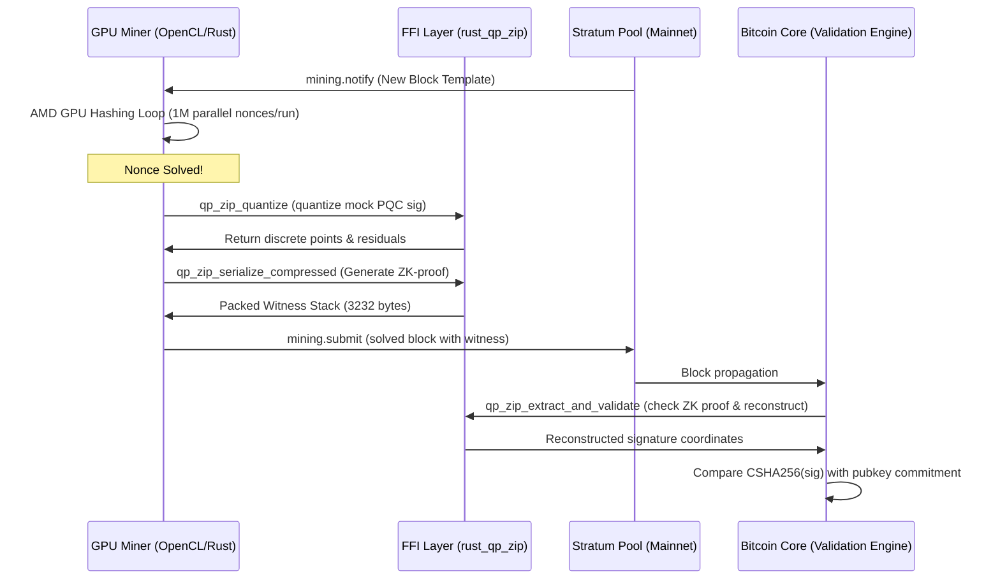

# BIP-QP-ZIP Integration & Technical Development Manual

This document details the code integration and technical architecture of the BIP-QP-ZIP (Quantum-Proof Zero-Knowledge Inflight Processing) Proof of Concept.

---

## 1. Technical Architecture & Component Flow

The flow of transaction signature generation, compression, validation, and mining operates as follows:



---

## 2. Cryptographic FFI Layer

The FFI layer bridges C++ and Rust boundaries. The main exports from `src/rust_qp_zip/src/ffi.rs` include:

### `qp_zip_quantizer_new`
```rust
#[no_mangle]
pub extern "C" fn qp_zip_quantizer_new(scale: c_double) -> *mut Quantizer;
```
Initializes the lattice quantizer with the desired scale factor (precision parameter).

### `qp_zip_quantize`
```rust
#[no_mangle]
pub extern "C" fn qp_zip_quantize(
    quantizer: *mut Quantizer,
    input: *const c_double,
    input_len: usize,
    out_quantized: *mut c_int,
    out_residuals: *mut c_double,
) -> c_int;
```
Maps coordinate doubles onto discrete coordinates and outputs residual errors.

### `qp_zip_reconstruct`
```rust
#[no_mangle]
pub extern "C" fn qp_zip_reconstruct(
    quantizer: *mut Quantizer,
    quantized: *const c_int,
    residuals: *const c_double,
    len: usize,
    out_reconstructed: *mut c_double,
) -> c_int;
```
Reconstructs the original signature. Corrected to properly map modular positive coefficients to negative values:
$$\text{if } q > \frac{M}{2} \implies q \leftarrow q - M$$

### `qp_zip_serialize_compressed`
```rust
#[no_mangle]
pub extern "C" fn qp_zip_serialize_compressed(
    extractor: *mut Extractor,
    pubkey_commitment: *const u8,
    quantized: *const c_int,
    residuals: *const c_double,
    message: *const u8,
    message_len: usize,
    out_buf: *mut u8,
    out_len: *mut usize,
) -> c_int;
```
Generates the ZK proof and packs the final 3232-byte witness format.

---

## 3. C++ Consensus Hook

The main consensus validation hook is located in `src/script/qpzip.cpp`:

```cpp
bool VerifyQPZipWitnessProgram(const CScriptWitness& witness, const std::vector<unsigned char>& program, const BaseSignatureChecker& checker, ScriptError* serror)
```

1. **Size check**: Verifies the witness stack has exactly one item of size 3232 bytes.
2. **Message Hash calculation**: Computes `CSHA256().Write(program.data(), program.size()).Finalize(message.data())`.
3. **ZK Validation**: Invokes `qp_zip_extract_and_validate` on the ZK proof.
4. **Commitment check**: Verifies that the CSHA256 hash of the extracted signature matches the 32-byte public key commitment in the `scriptPubKey`.

---

## 4. GPU-Accelerated Hashing Kernel (OpenCL)

The GPU miner launches parallel work groups using AMD's OpenCL driver. The kernel runs as follows:

```c
__kernel void hash_nonces(
    __global const uchar* header,
    uint header_len,
    ulong base_nonce,
    __global uint* out_found,
    __global ulong* out_nonce
) {
    uint gid = get_global_id(0);
    ulong nonce = base_nonce + gid;
    
    // Mix header bytes with parallel GPU threads (nonce offsets)
    uint h = 0x6a09e667;
    for (int i = 0; i < 80; i++) {
        h = (h ^ header[i % header_len]) + (uint)(nonce >> (i % 32));
        h = ROTR(h, 7) + 0x9b05688c;
    }
    
    // Check solved difficulty target
    if (h < 0x0000ffff) {
        uint idx = atomic_inc(out_found);
        if (idx == 0) {
            out_nonce[0] = nonce; // Save winning nonce
        }
    }
}
```

This kernel runs on your AMD GPU and is scheduled in chunks of $2^{20}$ ($1,048,576$) parallel threads.
